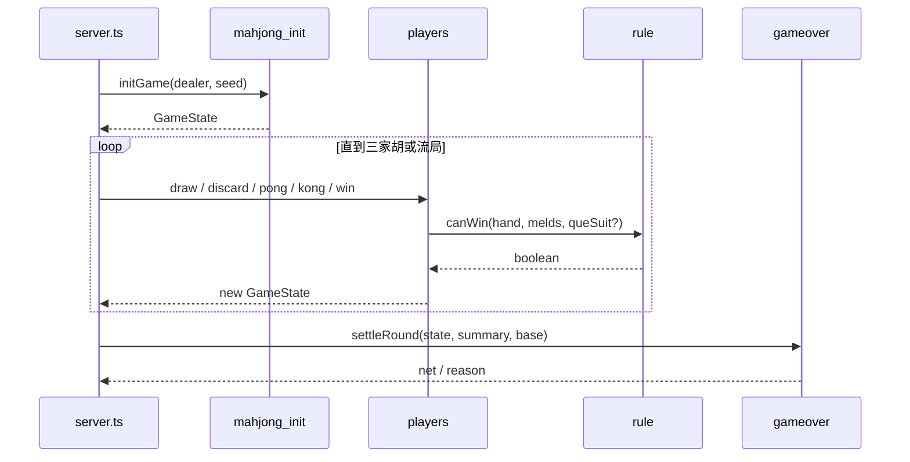
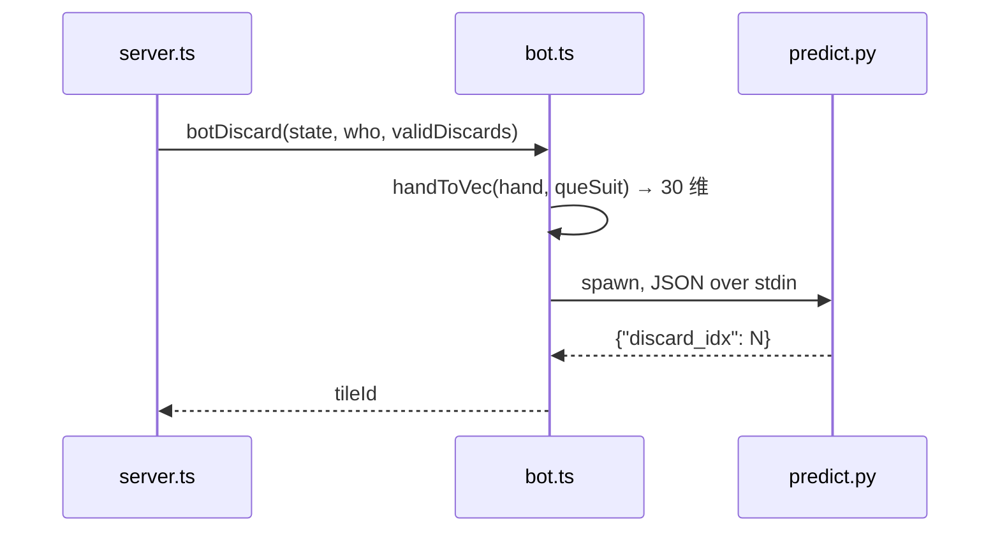
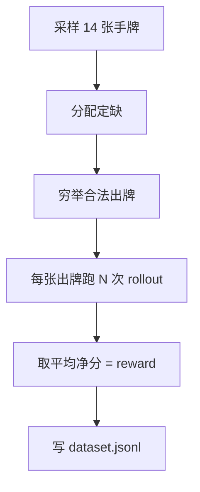

# 数据流

## 对局主循环

```mermaid
sequenceDiagram
    participant S as server.ts
    participant I as mahjong_init
    participant P as players
    participant R as rule
    participant G as gameover

    S->>I: initGame(dealer, seed)
    I-->>S: GameState
    loop 直到三家胡或流局
        S->>P: draw / discard / pong / kong / win
        P->>R: canWin(hand, melds, queSuit?)
        R-->>P: boolean
        P-->>S: new GameState
    end
    S->>G: settleRound(state, summary, base)
    G-->>S: net / reason
```

## 推理调用

bot 在 `discard` 阶段需要出牌时：

```mermaid
sequenceDiagram
    participant S as server.ts
    participant B as bot.ts
    participant PY as predict.py

    S->>B: botDiscard(state, who, validDiscards)
    B->>B: handToVec(hand, queSuit) → 30 维
    B->>PY: spawn, JSON over stdin
    PY-->>B: {"discard_idx": N}
    B-->>S: tileId
```

## Rollout 数据生成

```mermaid
flowchart TD
    H[采样 14 张手牌] --> Q[分配定缺]
    Q --> D[穷举合法出牌]
    D --> R[每张出牌跑 N 次 rollout]
    R --> M[取平均净分 = reward]
    M --> J[写 dataset.jsonl]
```

每次 rollout 用种子化随机对手模拟一局到结束，统计玩家 0 的净分。固定 seed 保证数据可复现。